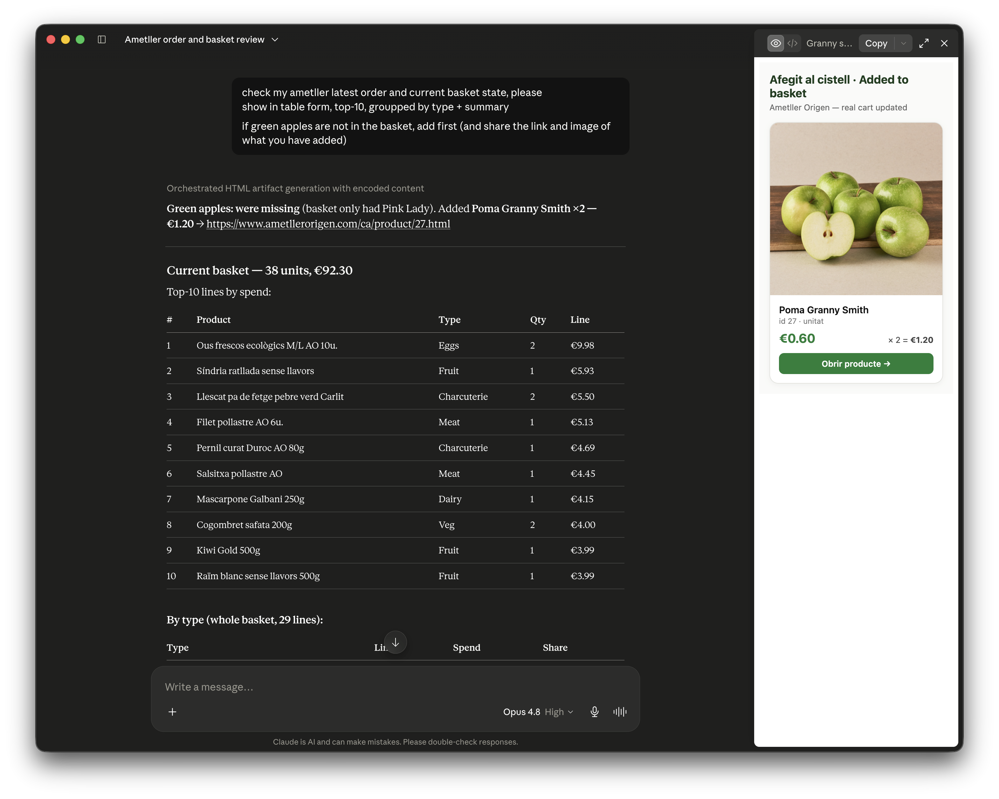

# Ametller Origen skill and MCP

Open Claude integration for Ametller Origen's live catalog, online orders, real cart, optional offline Gmail tickets, purchase analytics, and smart basket suggestions. It intentionally has no checkout, payment, delivery-slot, or order-placement tool. Chrome is used only to establish authorization; all catalog, order, analytics, and cart operations use APIs and never drive or scrape the shopping website.

Version 0.5 makes Claude's existing Gmail connection the primary offline-ticket path. It keeps the v0.4 backtested repeat-purchase model and explicit cart approval, while retaining the local `gws` workflow only as an optional automation fallback.

## Install in Claude Code

Requires current [Claude Code](https://code.claude.com/docs/en/setup), Node.js 20 or newer, and installed Google Chrome.

```bash
claude plugin marketplace add denya/ametller-origen-skill
claude plugin install ametller-origen@denya-grocery
```

Start or reload Claude Code, then ask for Ametller Origen or invoke `/ametller-origen:ametller-origen`. The MCP server starts automatically. On the first account action Claude opens the official Ametller login in Chrome; enter credentials and 2FA only in that browser. After the login response is captured, Chrome closes and normal operations use the direct API.

Claude Code stores the browser-created session in its persistent private plugin-data directory, not in the versioned plugin cache. Uninstall with `--keep-data` if you want to preserve that authorization.

For offline shop tickets, connect Gmail in Claude's **Connectors** settings. The integration uses that normal Gmail connection first; no separate Google CLI is needed.

## Install in Claude Desktop

Download the v0.5.2 installer:

**[Download Ametller Origen v0.5.2 for Claude Desktop (.mcpb)](https://github.com/denya/ametller-origen-skill/releases/download/v0.5.2/ametller-origen-0.5.2.mcpb)**

[Release notes and checksum](https://github.com/denya/ametller-origen-skill/releases/tag/v0.5.2)

1. Download the `.mcpb` file from the link above.
2. Open Claude Desktop on macOS.
3. Go to **Settings → Extensions → Advanced settings → Install Extension…**.
4. Select `ametller-origen-0.5.2.mcpb` and approve the installation.
5. Ask Claude to use Ametller Origen. Chrome opens only when account authorization is needed.



This release targets Claude Desktop on macOS. The bundle is self-contained; Node.js and Chrome are required. Desktop state is kept in `~/.ametller/session.json` with mode `0600`.

To build the same bundle from source instead:

```bash
git clone https://github.com/denya/ametller-origen-skill.git
cd ametller-origen-skill
npm ci
npm run pack:mcpb
```

## What you can ask

Think of the integration as two honest lanes: **repeat prediction** uses only products already present in your history, while **discovery** searches the live catalog for something new. Useful requests include:

- “Browse Ametller for kefir, show official images and links, and compare the exact pack sizes.”
- “Show my previous online orders and the latest offline shop tickets.”
- “Prepare a new basket, but let me review every item before anything is added.”
- “Suggest what I should buy today based on my previous online and offline orders.”
- “Show me something local or new.”
- “Find a sausage I have never tried.”
- “Suggest Spanish fruits I may not know as a Russian newcomer.”
- “Show my most frequent products and spending by month and category.”

The local/new, untried-sausage, and unfamiliar-fruit examples use live catalog/content exploration; a repeat-purchase model cannot infer a genuinely unseen product from one household's receipts. The optional `protein-rotation` mode is a separate experimental meal-planning objective: it improves protein-family coverage in the research audit but slightly reduces exact-product ranking accuracy.

## Test the local MCP

Build and verify the new server without touching a real account:

```bash
git clone https://github.com/denya/ametller-origen-skill.git
cd ametller-origen-skill
npm ci
npm run verify
```

`npm run verify` is the one-command checkout-free gate: unit/contract tests, isolated MCP smoke, no-browser login wiring, strict Claude plugin validation, MCPB validation, and dependency audit. It never invokes login or opens a browser. Secret/history scanning remains a separate release-maintainer gate using the repo's existing gitleaks configuration.

Run it as a local Claude Code plugin:

```bash
claude --plugin-dir "$(pwd)"
```

Then ask: “Suggest what I should buy today from my full online and offline Ametller history.” The first account read opens Chrome for sign-in if the saved session is missing or expired.

Automated packaging and E2E tests never open or navigate Chrome. `ametller_login` opens the official login only after a real user-initiated authorization request; an already saved session is used directly by API tests.

For Claude Desktop, build the one-click local extension:

```bash
npm run pack:mcpb
```

Install `dist/ametller-origen-0.5.2.mcpb` through **Settings → Extensions → Advanced settings → Install Extension…**. This bundle contains the interactive analytics view and offline-ticket ingestion. Anthropic MCP Apps support is required for the interactive view; other MCP clients still receive the structured text result.

## Offline tickets and CLI

For local development or direct use:

```bash
npm ci
npm run build
npm run login
npm run cli -- search 'quefir natural'
npm run cli -- cart
npm run cli -- orders all
npm run cli -- insights 12
npm run cli -- suggestions 12
npm run cli -- suggestions 12 protein-rotation
```

Offline store tickets are separate from SCAPI online orders. The recommended customer workflow uses Claude's connected Gmail integration:

> “Refresh my Ametller offline tickets from Gmail and update my purchase insights.”

Claude searches the exact digital-ticket subject, reads the messages through Gmail, and sends only normalized receipt fields to `ametller_ingest_offline_tickets`. Raw email bodies are not stored, and Gmail messages are not modified. See [Anthropic's Gmail integration documentation](https://claude.com/docs/connectors/google/gmail) for connection and privacy behavior.

As a second option, advanced local users can use Python 3 plus an authenticated [`gws`](https://github.com/googleworkspace/cli) on `PATH`:

```bash
npm run tickets:sync -- --overwrite
npm run cli -- tickets 50
```

Tickets default to `~/.ametller/tickets` with private directory/file modes. `ametller_get_offline_tickets` reads tickets ingested by either method. The `gws` sync remains optional and offline tickets are not part of Ametller's commerce API.

## Capabilities and boundaries

- Search products and return official links, all image variants, prices, units, and safe availability flags.
- Read complete paginated online order history and individual order lines.
- Sync and read offline digital tickets from Gmail without browser scraping.
- Group purchases, show monthly/category spend, and rank frequent products.
- Clean placeholders/service lines, remove exact duplicate receipts, merge same-day receipts for prediction, and rank repeat products with the validated 10/30/120-day recency model.
- Exclude the current API cart and resolve exact product/pack/price against the live catalog by id or a conservative name+price match.
- Add, set, remove, or reorder cart items after explicit approval; there is no checkout tool.

See [the predictor research](docs/NEXT-BASKET-RESEARCH.md) for the chronological evaluation and [the reusable shop-integration harness](docs/SHOP-INTEGRATION-HARNESS.md) for the release workflow.

Current limitations: offline category grouping is a transparent name-based estimate; receipt discounts are not allocated across categories; uncertain ticket-to-catalog matches are shown but cannot be selected; repeat prediction cannot score unseen products; live batch reorder remains less safely reversible than individual additions. Category browsing, search refinements, dedicated promotions, wishlists, and coupons are good future API candidates. Shipping, delivery, payment, and order placement are intentionally out of scope.

## Verify a checkout-free build

```bash
npm run verify
```

Release maintainers can separately run `npm run test:mcp:live` and `npm run e2e:readonly` for sanitized direct-API checks. The real-cart E2E additionally requires the explicit `AMETLLER_E2E_MUTATE=1` gate and refuses an originally absent or complex basket.

The committed `dist/server.mjs` is deterministic and lets Claude Code install without relying on `npm install` inside its plugin cache. Normal Chrome login is supported; Playwright's optional WebDriver-BiDi bridge is not bundled. Custom MCPB installation is supported, but this project has not been reviewed for Anthropic's public extension directory.

Live single-product cart restoration is release-tested. The multi-line **reorder** tool remains available, but its live mutation is not release-tested because unavailable historical products or promotion-generated bonus lines cannot be proven losslessly restorable in advance. Review the past order first and prefer adding its items individually when exact reversibility matters.

Maintained by [Denis Moskalets](https://github.com/denya). The main contact is [X/Twitter @denyamsk](https://x.com/denyamsk); you can also reach Denis on [Telegram @denyamsk](https://t.me/denyamsk).

MIT licensed. Based on Igor Safonov's MIT-licensed [Ametller Origen MCP extension](https://github.com/igorsafonov-gif/ametller-origen). Independent project; not affiliated with, endorsed by, or sponsored by Ametller Origen.
